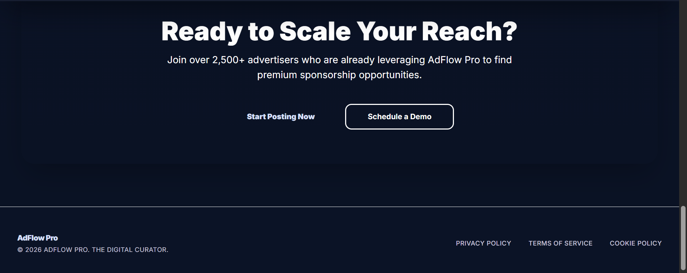
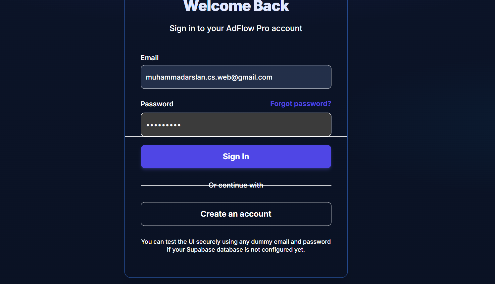
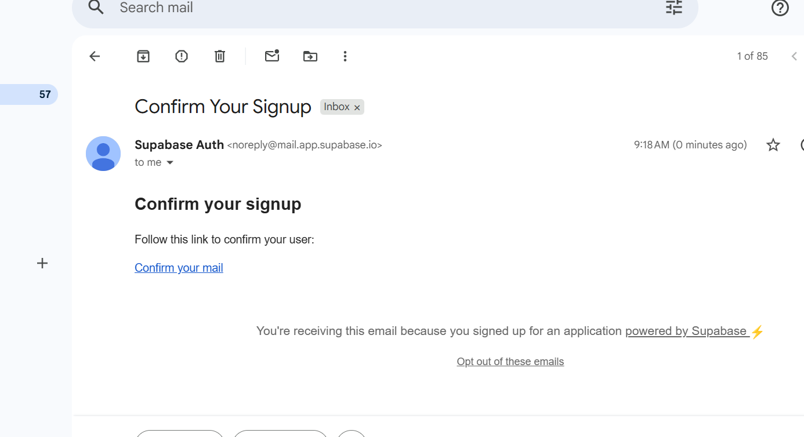
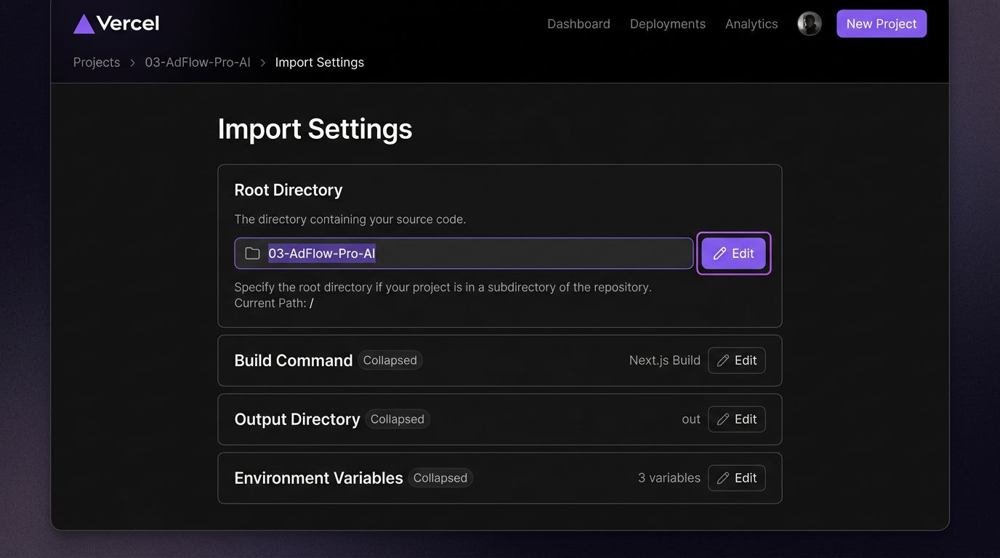

# AdFlow Pro

**Sponsored listing marketplace** — Next.js 14, Supabase, role-based dashboards, and a production-ready UI.

<p align="center">
  <a href="https://ad-flow-pro-ai.vercel.app"></a>
  &nbsp;
  <a href="https://github.com/Arslan-web-Dev/AdFlow-Pro-AI"></a>
</p>

<p align="center">
  <a href="https://nextjs.org/"></a>
  <a href="https://www.typescriptlang.org/"></a>
  <a href="https://supabase.com/"></a>
  <a href="https://opensource.org/licenses/MIT"></a>
</p>

---

### Quick links

| Resource | URL |
|----------|-----|
| **Live application** | [https://ad-flow-pro-ai.vercel.app](https://ad-flow-pro-ai.vercel.app) |
| **Source code** | [https://github.com/Arslan-web-Dev/AdFlow-Pro-AI](https://github.com/Arslan-web-Dev/AdFlow-Pro-AI) |
| **Deploy guide** | [docs/DEPLOY.md](docs/DEPLOY.md) |
| **Screenshots** | [Screenshots/](Screenshots/) (portfolio images in-repo) |

---

## Table of contents

| | |
|--|--|
| 1 | [Key features](#key-features) |
| 2 | [Core product overview](#core-product-overview) |
| 3 | [Profile, auth & accent themes](#profile-auth--accent-themes) |
| 4 | [Screenshots](#screenshots) |
| 5 | [Project summary](#project-summary) |
| 6 | [UI and design system](#ui-and-design-system) |
| 7 | [Technology stack](#technology-stack) |
| 8 | [Architecture](#architecture) |
| 9 | [Repository layout](#repository-layout) |
| 10 | [Routes](#routes) |
| 11 | [Authentication and RBAC](#authentication-and-rbac) |
| 12 | [Core systems](#core-systems) |
| 13 | [Database schema](#database-schema) |
| 14 | [Environment variables](#environment-variables) |
| 15 | [Getting started](#getting-started) |
| 16 | [Deploy (go live)](#deploy-go-live) |
| 17 | [Scripts](#scripts) |
| 18 | [Important files](#important-files) |
| 19 | [Roadmap](#roadmap) |
| 20 | [Contributing](#contributing) |
| 21 | [License](#license) |
| 22 | [Author](#author) |

---

## Key features

- **Dark marketplace UI** — Material-style tokens, glass header, gradients, **Inter** typography, responsive layouts.
- **Marketing site** — Landing with hero, featured listings, pricing, and clear CTAs to explore or sign up.
- **Browse & discovery** — **Explore** with filters (category, city, price), ranked listing cards, and smooth navigation to detail pages.
- **Listing pages** — **Ad detail** with media gallery, seller card, location, and package context.
- **Seller workspace** — **Dashboard** KPIs, ads table, activity, **create listing** wizard (category, city, package, payment steps), and profile/settings shells.
- **Trust & operations** — **Moderator** queue and **Admin** analytics, payments review, and user role management (UI flows; connect to Supabase for production data).
- **Auth & security** — **Supabase Auth** with `@supabase/ssr`; **`middleware.ts`** enforces sessions and **RBAC** (`client` → `moderator` → `admin` / `super_admin`).
- **Ranking** — `lib/ranking-system.ts` scores listings using featured flag, package weight, seller verification, freshness, and optional admin boost.
- **Optional AI** — `/api/ai/*` routes for helpers when `OPENAI_API_KEY` is set.
- **Integrated profile** — `/dashboard/profile` shows the signed-in user’s **email**, **@username**, and display name from Supabase Auth (real-time via `onAuthStateChange`); optional sync to `public.users` when your RLS policies allow updates.
- **Global accent themes** — **10 brand color presets** on the landing page (and again under Profile → Appearance). Choice is stored in `localStorage` and drives CSS variables across the whole app (`data-accent` on `<html>`).

---

## Core product overview

| Area | What users get |
|------|----------------|
| **Visitors** | Browse featured and ranked ads, open any listing, view pricing plans, and sign in or register. |
| **Clients (sellers)** | Post and manage sponsored listings, pick packages, and complete payment flows in the dashboard. |
| **Moderators** | Review pending content from a dedicated queue. |
| **Admins** | View analytics, verify payments, and adjust user roles. |

**Production note:** Sign-in on the [live demo](https://ad-flow-pro-ai.vercel.app) requires valid **Supabase** environment variables on Vercel (`NEXT_PUBLIC_SUPABASE_URL`, `NEXT_PUBLIC_SUPABASE_ANON_KEY`) and matching Auth/DB setup. Without them, the UI still loads but auth requests can fail (e.g. “Failed to fetch”).

---

## Profile, auth & accent themes

| Topic | Implementation |
|-------|------------------|
| **Session & profile row** | `components/providers/auth-provider.tsx` loads the Supabase session and, when possible, `public.users` (`role`, `name`, `avatar_url`) for the current user. |
| **Header / sidebar** | `components/layouts/dashboard-top-bar.tsx` shows **display name**, **@username**, and **role** for whoever is logged in (no more placeholder “Alex Sterling”). |
| **Profile & control panel** | `app/dashboard/profile/page.tsx` — account summary, read-only control info (user id, last sign-in), **Appearance** (accent buttons), and editable **username** / name / phone / city persisted with `auth.updateUser` + optional `users` update. |
| **Registration** | `app/auth/register/page.tsx` collects **username** (validated `a-z`, `0-9`, `_`, length 3–24) stored in `user_metadata`. |
| **Accent packs** | `lib/color-themes.ts` defines presets; `AccentThemeProvider` + `app/globals.css` `[data-accent="…"]` rules retint `--primary`, `--accent`, charts, and gradients site-wide. |

---

## Screenshots

Images below live in [`Screenshots/`](Screenshots/) (same folder name as on [GitHub](https://github.com/Arslan-web-Dev/AdFlow-Pro-AI/tree/main/Screenshots)). Filenames with spaces use URL-encoded paths so they render correctly on GitHub.

| File | What it shows |
|------|----------------|
| `lendingpage1.png` | Landing — hero & primary CTA |
| `lendingpage2.png` | Landing — featured / content section |
| `lendingpage3.png` | Landing — lower section (e.g. pricing teaser or footer) |
| `add page.png` | Seller flow — create or edit listing |
| `add details.png` | Listing detail — media, seller, metadata |
| `plans.png` | Pricing & packages |
| `loginpage.png` | Sign-in screen (`/auth/login`) |
| `Email_.png` | Email-related UI (signup / capture strip) |

**Monorepo deploy:** If this app is not at the Git repo root on Vercel, set **Root Directory** to the folder that contains `package.json` — illustrated in [`docs/screenshots/vercel-root-directory.png`](docs/screenshots/vercel-root-directory.png).

### Landing




### Create listing


### Listing detail


### Pricing


### Sign in



### Email



### Vercel: Root Directory (folder pick)



---

## Project summary

Unauthenticated users can use the marketing site, browse listings, and open ad details. After sign-in, users access `/dashboard`; moderators and admins additionally use `/moderator` and `/admin`. Session cookies and role checks are handled by Supabase and `middleware.ts`.

---

## UI and design system

Dark, **Material-inspired** palette: deep navy surfaces, indigo primary (`#4f46e5`), cyan accent, high-contrast text.

| Topic | Where |
|-------|--------|
| CSS variables and utilities | `app/globals.css` (`--background`, `--card`, `--primary`, `.af-glass-header`, `.af-gradient`, …) |
| Tailwind semantic colors | `tailwind.config.ts` — `surface`, `surface-container`, `on-surface`, … |
| Font | [Inter](https://fonts.google.com/specimen/Inter) in `app/layout.tsx` |
| Public chrome | `components/layouts/main-nav.tsx`, `site-footer.tsx` |
| App shell | `dashboard-shell.tsx`, `dashboard-sidebar.tsx` |

---

## Technology stack

### Frontend

| Layer | Technology |
|-------|------------|
| Framework | Next.js 14 (App Router), React 18 |
| Language | TypeScript 5 |
| Styling | Tailwind CSS v3, project tokens |
| Components | shadcn/ui-style + Base UI |
| Icons | Lucide React |
| Animations | `tailwindcss-animate`, `tw-animate-css` |
| Toasts | Sonner |

### Backend and data

| Layer | Technology |
|-------|------------|
| Database / BaaS | Supabase (PostgreSQL) |
| Auth | Supabase Auth + `@supabase/ssr` |
| Data fetching | TanStack Query v5 |
| Client state | Zustand |
| Validation | Zod |
| Charts | Recharts |
| Optional AI | OpenAI via `/api/ai/*` |

---

## Architecture

```
Browser
   │
   ▼
middleware.ts     Session refresh, auth, RBAC by path
   │
   ▼
Next.js App Router
   ├── Public:  /, /explore, /ad/[slug], /auth/*
   ├── /dashboard/*     (client+)
   ├── /moderator/*     (moderator+)
   └── /admin/*         (admin, super_admin)
   │
   ▼
Supabase (PostgreSQL: users, ads, categories, cities, packages, payments)
```

---

## Repository layout

```
AdFlow-Pro-AI/
├── Screenshots/            # README portfolio images (landing, login, …)
├── docs/
│   ├── screenshots/        # e.g. vercel-root-directory.png (deploy)
│   └── DEPLOY.md
├── app/                      # Routes, layouts, API routes
├── components/               # layouts/, providers/, theme/, ui/
├── lib/                      # supabase/, color-themes, auth-display, dummy-data, …
├── middleware.ts
├── next.config.mjs
├── tailwind.config.ts
└── package.json
```

---

## Routes

### Public

| Path | Description |
|------|-------------|
| `/` | Marketing and pricing |
| `/explore` | Browse listings |
| `/ad/[slug]` | Listing detail |
| `/auth/*` | Login, register, OAuth callback |

### Authenticated (representative)

| Prefix | Minimum role |
|--------|----------------|
| `/dashboard` | `client` |
| `/moderator` | `moderator` |
| `/admin` | `admin` or `super_admin` |

### API (representative)

| Prefix | Purpose |
|--------|---------|
| `/api/ai/*` | Optional AI helpers |
| `/api/cron/*` | Scheduled jobs (e.g. expiry) |

---

## Authentication and RBAC

1. **Supabase Auth** creates the session; **`@supabase/ssr`** reads/writes cookies on server and client.
2. **`middleware.ts`** refreshes the session, loads the user, reads `role` from `public.users`, and redirects if the role is insufficient for the path.
3. **`DashboardSidebar`** adjusts visible links based on whether you are under `/admin`, `/moderator`, or `/dashboard`.

Illustrative logic (see `middleware.ts` for the real code):

```typescript
if (!user && isProtectedPath(pathname)) redirect('/auth/login')
if (pathname.startsWith('/admin') && !isAdminRole(role)) redirect('/dashboard')
```

Role capability (high → low): `super_admin`, `admin`, `moderator`, `client`.

---

## Core systems

### Listing rank

**File:** `lib/ranking-system.ts` — combines featured status, package weight, seller verification, admin boost, and time-based freshness. Higher scores sort earlier when the browse API uses this field.

### Supabase clients

| File | Context |
|------|---------|
| `lib/supabase/client.ts` | Client Components |
| `lib/supabase/server.ts` | Server Components, Route Handlers, `middleware.ts` |

### UI kit

Shared primitives live in `components/ui/` and follow the same design tokens as the rest of the app.

---

## Database schema

Run in the Supabase SQL editor (adjust naming and add **RLS** for production):

```sql
CREATE TABLE public.users (
  id          UUID PRIMARY KEY REFERENCES auth.users(id),
  role        TEXT NOT NULL DEFAULT 'client',
  name        TEXT,
  avatar_url  TEXT,
  is_verified BOOLEAN DEFAULT false,
  created_at  TIMESTAMPTZ DEFAULT NOW()
);

CREATE TABLE public.categories (
  id    SERIAL PRIMARY KEY,
  name  TEXT NOT NULL,
  slug  TEXT NOT NULL UNIQUE,
  icon  TEXT
);

CREATE TABLE public.cities (
  id    SERIAL PRIMARY KEY,
  name  TEXT NOT NULL,
  state TEXT
);

CREATE TABLE public.packages (
  id             SERIAL PRIMARY KEY,
  name           TEXT NOT NULL,
  price          NUMERIC(10, 2) NOT NULL,
  duration_days  INTEGER NOT NULL,
  weight         INTEGER NOT NULL DEFAULT 0,
  is_featured    BOOLEAN DEFAULT false
);

CREATE TABLE public.ads (
  id           UUID PRIMARY KEY DEFAULT gen_random_uuid(),
  seller_id    UUID REFERENCES public.users(id),
  category_id  INTEGER REFERENCES public.categories(id),
  city_id      INTEGER REFERENCES public.cities(id),
  package_id   INTEGER REFERENCES public.packages(id),
  title        TEXT NOT NULL,
  slug         TEXT NOT NULL UNIQUE,
  description  TEXT,
  price        NUMERIC(12, 2) NOT NULL,
  thumbnail    TEXT,
  status       TEXT DEFAULT 'pending',
  is_featured  BOOLEAN DEFAULT false,
  admin_boost  INTEGER DEFAULT 0,
  rank_score   INTEGER DEFAULT 0,
  expires_at   TIMESTAMPTZ,
  created_at   TIMESTAMPTZ DEFAULT NOW()
);

CREATE TABLE public.payments (
  id           UUID PRIMARY KEY DEFAULT gen_random_uuid(),
  user_id      UUID REFERENCES public.users(id),
  ad_id        UUID REFERENCES public.ads(id),
  package_id   INTEGER REFERENCES public.packages(id),
  amount       NUMERIC(10, 2) NOT NULL,
  status       TEXT DEFAULT 'pending',
  proof_url    TEXT,
  created_at   TIMESTAMPTZ DEFAULT NOW()
);
```

---

## Environment variables

Root file: **`.env.local`** (do not commit).

```bash
NEXT_PUBLIC_SUPABASE_URL=https://YOUR_PROJECT_REF.supabase.co
NEXT_PUBLIC_SUPABASE_ANON_KEY=YOUR_ANON_KEY

# Optional
# OPENAI_API_KEY=
# CRON_SECRET=
```

Only `NEXT_PUBLIC_*` keys are available in the browser.

---

## Getting started

**Prerequisites:** Node.js ≥ 18.17, npm ≥ 9 (or pnpm/yarn), a Supabase project.

```bash
git clone https://github.com/Arslan-web-Dev/AdFlow-Pro-AI.git
cd AdFlow-Pro-AI
npm install
```

Create `.env.local` as above, run the SQL schema in Supabase, seed data if needed (or use `lib/dummy-data.ts` for local UI only).

```bash
npm run dev
```

Application: [http://localhost:3000](http://localhost:3000).

---

## Deploy (go live)

Use the [Vercel dashboard](https://vercel.com/muhammad-arslans-projects-6abbf6f8) (GitHub login) and import **[Arslan-web-Dev/AdFlow-Pro-AI](https://github.com/Arslan-web-Dev/AdFlow-Pro-AI)**.

1. Push the repo to GitHub.
2. **Add New → Project** → import the repository.
3. **Root Directory:** leave default **`.`** when this repo is only the Next.js app. If the app lives inside a **parent monorepo folder**, set Root Directory to that subfolder (see screenshot in [Screenshots](#screenshots)).
4. **Environment variables:** `NEXT_PUBLIC_SUPABASE_URL`, `NEXT_PUBLIC_SUPABASE_ANON_KEY` (required for real sign-in on production).
5. **Deploy** → example URL: [ad-flow-pro-ai.vercel.app](https://ad-flow-pro-ai.vercel.app).

Full steps: [`docs/DEPLOY.md`](docs/DEPLOY.md).

---

## Scripts

| Command | Description |
|---------|-------------|
| `npm run dev` | Development server |
| `npm run build` | Production build (runs lint) |
| `npm start` | Serve production build |
| `npm run lint` | ESLint |

---

## Important files

| Path | Purpose |
|------|---------|
| `middleware.ts` | Auth + RBAC |
| `app/layout.tsx` | Root layout, `AccentThemeProvider`, `AuthProvider` |
| `app/globals.css` | Design tokens + `[data-accent]` theme packs |
| `lib/color-themes.ts` | Accent preset definitions |
| `lib/auth-display.ts` | Display name / username helpers |
| `lib/ranking-system.ts` | Listing score |
| `lib/supabase/client.ts`, `server.ts` | Supabase entry points |
| `components/providers/auth-provider.tsx` | Session + `public.users` profile |
| `app/dashboard/profile/page.tsx` | Profile & control panel |
| `components/layouts/dashboard-top-bar.tsx` | Live user header |
| `components/layouts/dashboard-sidebar.tsx` | Nav + mobile drawer |

---

## Roadmap

- [ ] Wire UI to live Supabase data
- [ ] Working explore filters (category, city, price)
- [ ] Media upload for new listings
- [ ] Persist moderator actions
- [ ] Admin payment review flow
- [ ] Row Level Security on all tables
- [x] Deploy to Vercel (set Supabase env vars for working auth)

---

## Contributing

Issues and pull requests are welcome on your fork. For course submissions, follow your instructor’s collaboration rules.

---

## License

MIT. Add a root `LICENSE` file if your institution or publication requires it.

---

## Author

**Muhammad Arslan** — FA23-BCS-030 · Web technologies — AdFlow Pro (coursework).
